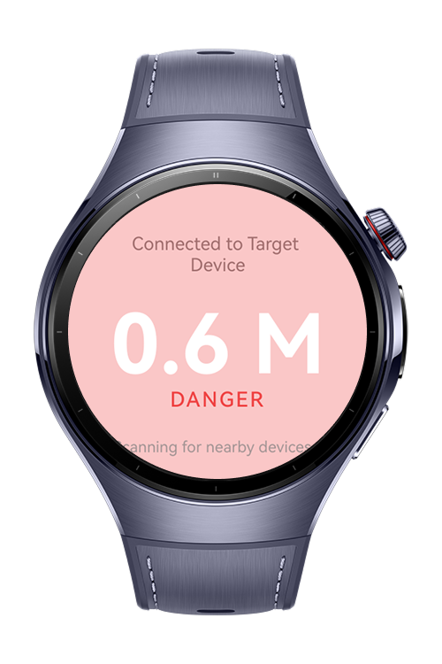
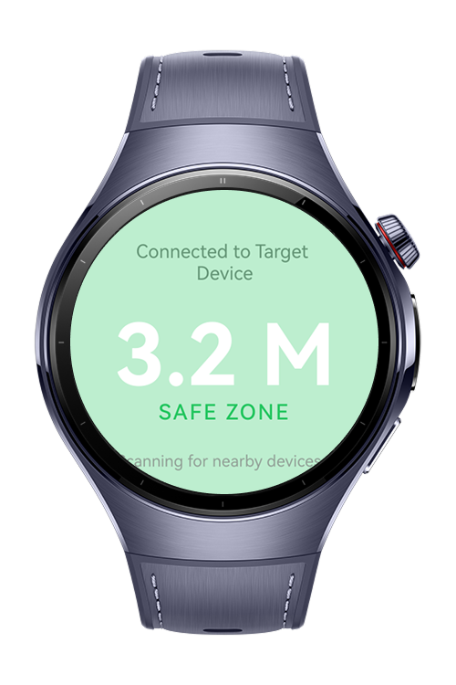
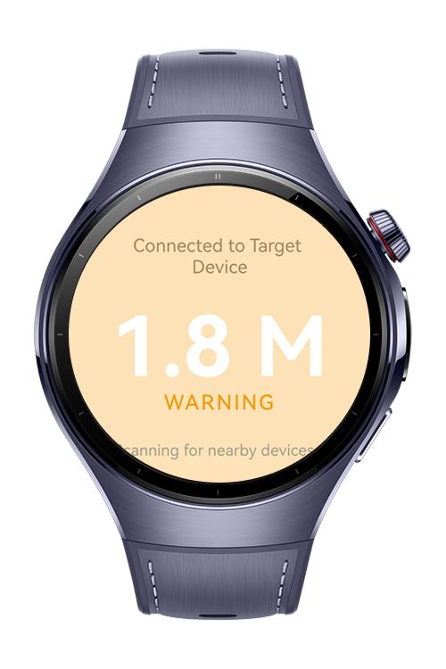

> **Note:** To access all shared projects, get information about environment setup, and view other guides, please visit [Explore-In-HMOS-Wearable Index](https://github.com/Explore-In-HMOS-Wearable/hmos-index).

# Safe Zone

SafeZone is an innovative sample application built for HarmonyOS-based wearable devices, primarily demonstrating the efficient integration of low-level system services to create real-time, proximity-based alerts. The core function of SafeZone is to establish device-to-device awareness by continuously scanning for and advertising Bluetooth Low Energy (BLE) signals.

By utilizing the ConnectivityKit Kit and the standard Bluetooth API, the application measures the approximate distance between two nearby compatible wearables (via RSSI calculation). The primary user benefit is instantaneous and visual notification when the distance falls below a configurable safe threshold, promoting smart social and environmental awareness on a compact platform.

<p align="left">
    
    
    
</p>


# Use Cases
- Social and Physical Distancing: Provides subtle, real-time alerts to users when they breach a predetermined social distance threshold (e.g., 1.5 meters) relative to another equipped device.

- Child Safety and Guardianship: Allows a parent or guardian's watch to alert them immediately if a child (also wearing a device) moves outside a close proximity range (e.g., 5-10 meters), acting as a digital leash.

- Industrial and Workplace Safety: Ensures workers maintain a safe operating perimeter around heavy machinery, high-voltage areas, or dangerous equipment where physical markers may be insufficient.

- Asset Tracking and Theft Prevention: Alerts the user if a tagged item (e.g., a specific tool, bag, or wallet broadcasting the required BLE advertisement) is left behind or moved beyond a close range.

- Collaborative Learning/Training: Facilitates exercises where maintaining formation or specific distances between team members is mandatory (e.g., medical training, military drills).

# Technology Stack
**Languages**: ArkTS, ArkUI  
**Frameworks**: HarmonyOS SDK 5.1.0  
**Tools**: DevEco Studio 5.1.0 Beta1
**Libraries/Kits**:
- @kit.ArkUI
- @kit.AbilityKit
- @kit.ConnectivityKit
- @kit.BasicServicesKit


# Directory Structure
```
│   .gitignore
│   build-profile.json5
│   hvigorfile.ts
│   obfuscation-rules.txt
│   oh-package.json5
│
└───src
    ├───main
    │   │   module.json5
    │   │
    │   ├───ets
    │   │   ├───entryability
    │   │   │       EntryAbility.ets
    │   │   │
    │   │   ├───entrybackupability
    │   │   │       EntryBackupAbility.ets
    │   │   │
    │   │   ├───pages
    │   │   │       Index.ets
    │   │   │
    │   │   └───utils
    │   │           BleAdvertisingManager.ets
    │   │           BleScanManager.ets
    │   │           RequestPermission.ets
    │   │
    │   └───resources
    │       ├───base
    │       │   ├───element
    │       │   │       color.json
    │       │   │       float.json
    │       │   │       string.json
    │       │   │
    │       │   ├───media
    │       │   │
    │       │   └───profile
    │       │
    │       ├───dark
    │       └───rawfile
    │
    ├───ohosTest

```


# Constraints and Restrictions
- The application requires the following user permissions to function properly:

  - ohos.permission.ACCESS_BLUETOOTH – for accessing precise location data.

- Without the necessary permissions, certain features may not operate correctly.

## Supported Device
- Huawei Watch 5

# License

**SafeZone** is distributed under the terms of the **MIT License**.  
See the [LICENSE](LICENSE) file for more information.  
